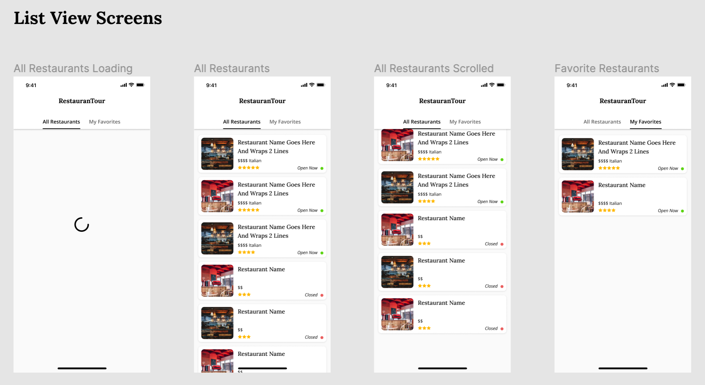
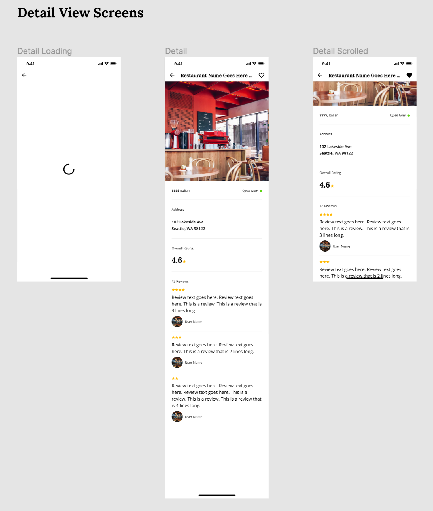

# RestauranTour Development Guidelines

This document contains **all** the necessary instructions and guidelines for developing the RestauranTour application. To ensure a seamless development process, it is highly recommended that you read this document thoroughly and adhere to the outlined guidelines.

## Specifications

### Application Structure

#### 1. Restaurant List Page

The page includes a Tab Bar with the following tabs:

- **Favorites Tab**: Displays the list of favorite restaurants saved on the client side.
- **Businesses Tab**: Shows a list of all businesses. Each business listing should include:
  - A hero image
  - Business name
  - Price
  - Category
  - Rating (rounded to the nearest value)
  - Current operational status (Open/Closed)

#### 2. Restaurant Detail View

This view should allow users to favorite a business and present details such as:

- Business name
- Hero image
- Price and category
- Address
- Rating
- Total number of reviews
- List of reviews with each review displaying:
  - User's name
  - Rating
  - User's image
  - Snippet of the review text (usually 3-4 lines long)

#### 3. Miscellaneous

Ensure to provide clear documentation on the application's structure and architecture along with coherent and logical commit messages. It is recommended to follow the [Conventional Commits](https://www.conventionalcommits.org/en/v1.0.0/) style.

## Test Coverage

To showcase your proficiency in writing various types of tests in Flutter, please adhere to the following:

- Write a unit test for ONE part of your state management.
- Write a widget test for ONE widget.

You are welcome to incorporate additional tests as deemed necessary. However, the above stipulated tests are mandatory.

## Design 

Design instructions and visual cues are provided in this [Figma File](https://www.figma.com/file/ThciXA0cFyIvOF0QeqZMK1/Flutter-Test---The-Change-Company?type=design&node-id=0%3A1&mode=design&t=gB0RrUopVzFOBjr1-1). Aim for a close resemblance with the design but pixel-perfection is not expected.

## API

The [Yelp GraphQL API](https://www.yelp.com/developers/graphql/guides/intro) is used as the API for this Application. We have provided the boilerplate of the API requests and backing data models to save you some time. To successfully make a request to the Yelp GraphQL API, please follow these steps:

1. Please go to https://www.yelp.com/signup and sign up for a developer account.
1. Once signed up, navigate to https://www.yelp.com/developers/v3/manage_app.
1. Create a new app by filling out the required information.
1. Once your app is created, scroll down and join the `Developer Beta`. This allows you to use the GraphQL API.
1. Copy your API Key from your app page and paste it on `line 5` [yelp_repository.dart](app/lib/yelp_repository.dart) replacing the `<PUT YOUR API KEY HERE>` with your key.
1. Run the app and tap the `Fetch Restaurants` button. If you see a log like `Fetched x restaurants` you are all set!

## Technical Requirements

### State Management

Please restrict your state management or dependency injection implementations to the following options:

1. [async redux](https://pub.dev/packages/async_redux)
2. [bloc](https://pub.dev/packages/bloc)

The challenge focuses on consistency and efficiency over creativity. Usage of widely adopted libraries will streamline the code review process and enable us to provide more constructive feedback.

## Core Coding Principles

At **The Change Company**, we endeavor to build applications embodying:

- Consistent architecture
- Extendable, clean code
- Robust testing
- Solid security and performance best practices

### Clear, consistent architecture

Consider this project as a real-world application. Employ any libraries that are a part of your standard toolset.

_Note: The emphasis is on your coding approach and problem-solving ability rather than proficiency with a specific library or feature._

### Clarity and simplicity

We value code that is straightforward and easy to understand at **The Change Company**.

We're equally interested in your problem-solving methodology as we are in the final output.

### Comprehensive testing approach

The purpose of this challenge is not to achieve 100% test coverage but to assess your understanding of what and how to test effectively.

## Frequently Asked Questions

- **How should I submit the completed project?**

  Please create a fork of this repository and submit a pull request to our repo upon completion. There is no set deadline for this task unless specifically mentioned.

- **What should I do if I have a question?**

  Please create a new issue in this repo and we will respond promptly.

## Review Process

Upon completion, your submission will undergo a detailed code review with our mobile engineers. You will be required to present your solution, share your screen, and demo the application during this review. Our engineers will engage with you by asking various questions related to your submission.
